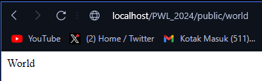
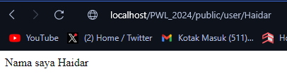
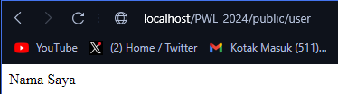
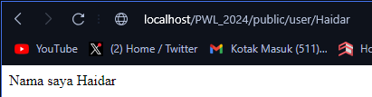
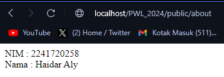
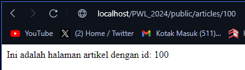
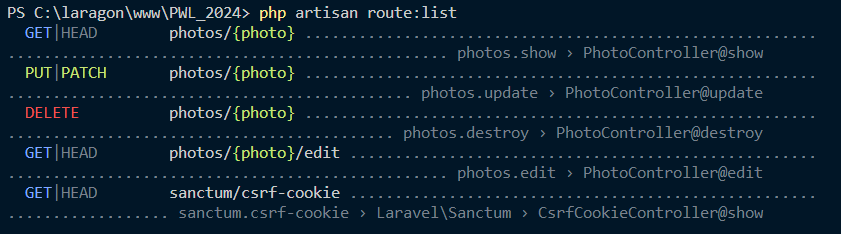
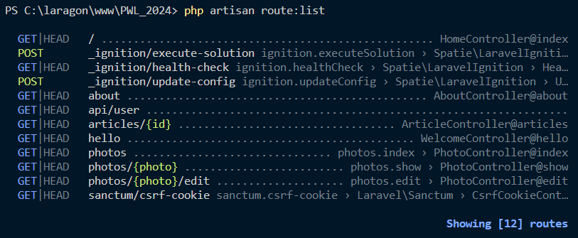
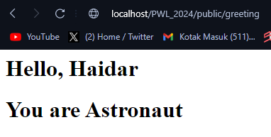

# Jobsheet 2 : ROUTING, CONTROLLER, DAN VIEW

> Nama : Haidar Aly

> Kelas : TI-2F

> Absen : 14

## Praktikum 1

### Basic Routing
#### /hello route
```php
Route::get('/hello', function () {
    return 'Hello World';
});
```


#### /world route
```php
Route::get('/world', function () {
     return 'World';
});
```


### Route Parameters
#### /user route
```php
Route::get('/user/{name}', function ($name) {
     return 'Nama saya '. $name;
});
```


#### posts/comments route
```php
Route::get('/posts/{post}/comments/{comment}', function ($postId, $commentId) {
     return 'Pos ke-'. $postId. ', Komentar ke-: '. $commentId;
});
```


### Optional Parameters
#### /user route (Null value)
```php
Route::get('/user/{name?}', function ($name = null) {
    return 'Nama Saya '. $name;
});
```
##### Before



##### After


#### /user route (name value)
```php
Route::get('/user/{name?}', function ($name = 'Haidar') {
    return 'Nama Saya '. $name;
});
```


## Praktikum 2
### Membuat Controller
#### Welcome Controller
```php
<?php

namespace App\Http\Controllers;

use Illuminate\Http\Request;

class WelcomeController extends Controller
{
    public function hello() {
        return 'Hello World';
    }
}
```
#### Route Welcome Controller
```php
Route::get('/hello', [WelcomeController::class,'hello']);
```


#### Page Controller
```php
<?php

namespace App\Http\Controllers;

use Illuminate\Http\Request;

class PageController extends Controller
{
    //
    public function about() {
        return 'NIM : 2241720258
                <br>
                Nama : Haidar Aly';
    }

    public function articles($id)
    {
        return 'Ini adalah halaman artikel dengan id: '. $id;
    }

    public function index() {
        return 'Selamat Datang';
    }   
}
```
#### Route Page Controller
```php
Route::get('/', [PageController::class,'index']);
Route::get('/about', [PageController::class,'about']);
Route::get('/articles/{id}', [PageController::class,'articles']);
```




#### Home Controller
```php
<?php

namespace App\Http\Controllers;

use Illuminate\Http\Request;

class HomeController extends Controller
{
    //
    public function index() {
        return 'Selamat Datang';
    }   
}
```
#### Route Home Controller
```php
Route::get('/', [HomeController::class,'index']);
```


#### About Controller
```php
<?php

namespace App\Http\Controllers;

use Illuminate\Http\Request;

class AboutController extends Controller
{
    //
    public function about() {
        return 'NIM : 2241720258
                <br>
                Nama : Haidar Aly';
    }
}
```
#### Route About Controller
```php
Route::get('/about', [AboutController::class,'about']);
```


#### Articles Controller
```php
<?php

namespace App\Http\Controllers;

use Illuminate\Http\Request;

class ArticleController extends Controller
{
    //
    public function articles($id)
    {
        return 'Ini adalah halaman artikel dengan id: '. $id;
    }
}
```
#### Route Articles Controller
```php
Route::get('/articles/{id}', [ArticleController::class,'articles']);
```


### Resource Controller
#### Photo Controller
```php 
<?php

namespace App\Http\Controllers;

use Illuminate\Http\Request;

class PhotoController extends Controller
{
    /**
     * Display a listing of the resource.
     */
    public function index()
    {
        //
    }

    /**
     * Show the form for creating a new resource.
     */
    public function create()
    {
        //
    }

    /**
     * Store a newly created resource in storage.
     */
    public function store(Request $request)
    {
        //
    }

    /**
     * Display the specified resource.
     */
    public function show(string $id)
    {
        //
    }

    /**
     * Show the form for editing the specified resource.
     */
    public function edit(string $id)
    {
        //
    }

    /**
     * Update the specified resource in storage.
     */
    public function update(Request $request, string $id)
    {
        //
    }

    /**
     * Remove the specified resource from storage.
     */
    public function destroy(string $id)
    {
        //
    }
}
```
#### Route Photo Controller
```php
Route::resource('photos', PhotoController::class);
```


#### Route Photo Controller
```php
Route::resource('photos', PhotoController::class)->only([
    'index','show'
]);

Route::resource('photos', PhotoController::class)->except([
    'create','store', 'update', 'destroy'
]);
```


## Praktikum 3
### Membuat View
#### hello.blade.php
```html
<!-- View pada resource/views/blog/hello.blade.php -->
<html>
    <body>
        <h1>Hello, {{ $name }}</h1>
        <h1>You are {{ $occupation }}</h1>
    </body>
</html>
```

#### Controller blade.php
```php
<?php

namespace App\Http\Controllers;

use Illuminate\Http\Request;

class WelcomeController extends Controller
{
    public function hello() {
        return 'Hello World';
    }

    public function greeting() {
        return view('blog.hello')
            ->with('name', 'Haidar')
            ->with('occupation', 'Astronaut');
    }
}
```

#### route blade.php
```php
Route::get('/greeting', function () {
     return view('blog.hello', ['name' => 'Haidar']);
});

Route::get('/greeting', [WelcomeController::class,'greeting']);
```

